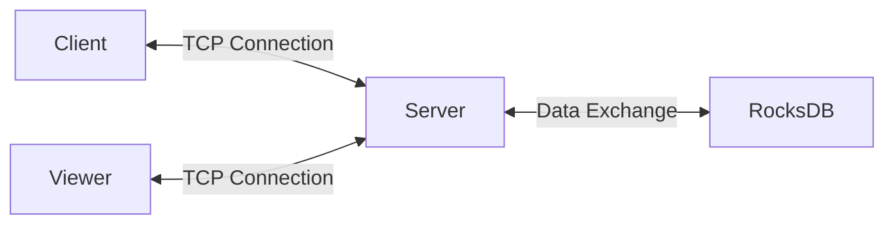

# RocksDBFusion

RocksDBFusion is a comprehensive project designed to provide a unified and efficient way to manage and interact with RocksDB across different platforms and languages. It includes a cross-platform server and multiple clients that communicate with the server via TCP, which in turn exchanges data with RocksDB.

This project is perfect for anyone looking to manage RocksDB efficiently across various platforms and languages. With RocksDBFusion, you can easily set up the server and clients, facilitating seamless data exchange through a TCP connection.

Certainly! Here's the updated performance comparison section for your README:
Certainly! Here’s the updated performance comparison section with the additional information about the context of the comparison:

## Performance Comparison

### RocksDBFusion Performance

| Task Name | ops/sec  | Average Time (ns)  | Margin   | Samples |
|-----------|----------|--------------------|----------|---------|
| 'put'     | 24,368   | 41,036.01          | ±1.23%   | 24,369  |
| 'get'     | 30,044   | 33,283.73          | ±0.28%   | 30,045  |
| 'delete'  | 25,948   | 38,537.79          | ±0.32%   | 25,949  |

### Redis Performance

| Task Name | ops/sec  | Average Time (ns)  | Margin   | Samples |
|-----------|----------|--------------------|----------|---------|
| 'put'     | 33,585   | 29,774.45          | ±0.44%   | 33,586  |
| 'get'     | 41,173   | 24,287.20          | ±0.44%   | 41,175  |
| 'delete'  | 47,475   | 21,063.69          | ±0.44%   | 47,476  |

### MySQL Performance

| Task Name | ops/sec  | Average Time (ns)  | Margin    | Samples |
|-----------|----------|--------------------|-----------|---------|
| 'put'     | 6,473    | 154,477.65         | ±10.23%   | 6,474   |
| 'get'     | 460      | 2,169,560.10       | ±11.12%   | 461     |
| 'delete'  | 666      | 1,500,005.94       | ±15.27%   | 667     |

### PostgreSQL Performance

| Task Name | ops/sec  | Average Time (ns)  | Margin   | Samples |
|-----------|----------|--------------------|----------|---------|
| 'put'     | 6,375    | 156,850.96         | ±0.71%   | 6,376   |
| 'get'     | 309      | 3,228,153.49       | ±2.26%   | 310     |
| 'delete'  | 15,573   | 64,209.74          | ±1.08%   | 15,574  |

### Percentage Difference with RocksDBFusion

| Task Name | RocksDBFusion ops/sec | MySQL ops/sec | Redis ops/sec | PostgreSQL ops/sec | MySQL % Difference | Redis % Difference | PostgreSQL % Difference |
|-----------|-----------------------|---------------|---------------|--------------------|--------------------|--------------------|-------------------------|
| 'put'     | 24,368                | 6,473         | 33,585        | 6,375              | -73.43%            | +37.88%            | -73.85%                 |
| 'get'     | 30,044                | 460           | 41,173        | 309                | -98.47%            | +37.05%            | -98.97%                 |
| 'delete'  | 25,948                | 666           | 47,475        | 15,573             | -97.43%            | +82.99%            | -40.00%                 |

### Important Note
The performance metrics provided for MySQL and PostgreSQL are for general understanding and should be taken in context. Comparing key-value stores like RocksDBFusion and Redis with relational databases such as MySQL and PostgreSQL is not straightforward due to their different architectures, data models, and use cases. The benchmarks for relational databases are included to provide a broad perspective, but they are not directly comparable to those of key-value stores.