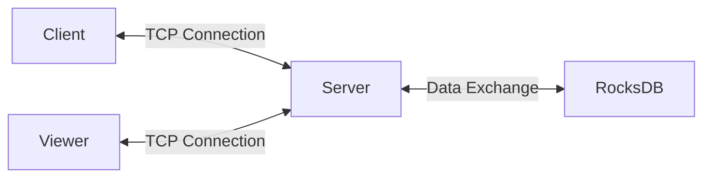

# RocksDBFusion

RocksDBFusion is a comprehensive project designed to provide a unified and efficient way to manage and interact with RocksDB across different platforms and languages. It includes a cross-platform server and multiple clients that communicate with the server via TCP, which in turn exchanges data with RocksDB.

This project is perfect for anyone looking to manage RocksDB efficiently across various platforms and languages. With RocksDBFusion, you can easily set up the server and clients, facilitating seamless data exchange through a TCP connection.

### Performance Table

| Task Name | ops/sec | Average Time (ns) | Margin   | Samples |
|-----------|---------|-------------------|----------|---------|
| 'put'     | 15,151  | 66,001.68         | ±1.14%   | 15,152  |
| 'get'     | 18,665  | 53,574.02         | ±0.71%   | 18,666  |
| 'delete'  | 15,040  | 66,488.36         | ±1.04%   | 15,041  |
