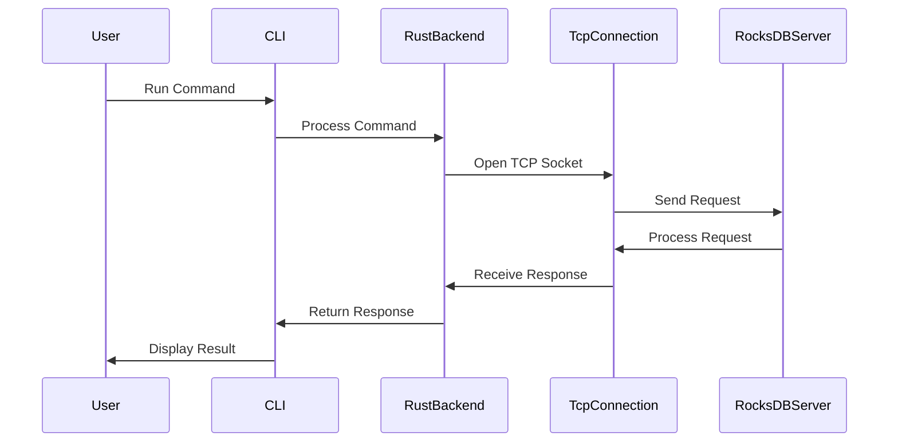

## RocksDB CLI Client

A simple CLI client to interact with a RocksDB database. This client allows you to perform various operations such as storing, retrieving, deleting, and merging key-value pairs. It also supports advanced operations like managing column families and transactions.

## Features

- Store a key-value pair in the database
- Retrieve the value of a key from the database
- Delete a key from the database
- Merge a value with an existing key
- List all column families in the database
- Create and drop column families
- Compact the database within a range
- Support for transactions (begin, commit, rollback)

## Prerequisites

- [Rust](https://www.rust-lang.org/tools/install) (only for building from source)

## Getting Started

### Download the Application

Pre-built versions of the application are available in the [Releases](https://github.com/s00d/RocksDBFusion/releases). You can download the appropriate version for your operating system and run the application directly.

For example, you can download the specific version from [this link](https://github.com/s00d/RocksDBFusion/releases/tag/rocksdb-cli-v0.1.1).

### Extract the Downloaded Archive

After downloading the appropriate archive for your operating system, extract it:

```bash
tar -xzf rocksdb_cli-<platform>.tar.gz  # For Linux and macOS
# or
7z x rocksdb_cli-<platform>.zip         # For Windows
```

### Install with Homebrew (macOS)

You can also install RocksDB CLI Client using Homebrew on macOS. First, make sure to tap the repository:

```sh
brew tap s00d/rocksdbserver
```

Then, install the RocksDB CLI Client:

```sh
brew install rocksdb_cli
```

### Run the Application

Navigate to the directory where the binary is extracted and run the application:

```bash
./rocksdb_cli ...
```

### macOS Sign

If you are on macOS, you may need to sign the application before running it. Here are the steps:

1. Make the binary executable:

    ```bash
    chmod +x ./rocksdb_cli
    ```

2. Clear extended attributes and sign the binary:

    ```bash
    xattr -cr ./rocksdb_cli && codesign --force --deep --sign - ./rocksdb_cli
    ```

### Command Usage

#### Common Options

- `--host`: Server host (default: `127.0.0.1`)
- `--port`: Server port (default: `12345`)

#### Store a Key-Value Pair

```bash
./rocksdb_cli put --host 127.0.0.1 --port 12345 <key> <value>
```

#### Retrieve the Value of a Key

```bash
./rocksdb_cli get --host 127.0.0.1 --port 12345 <key>
```

#### Delete a Key

```bash
./rocksdb_cli delete --host 127.0.0.1 --port 12345 <key>
```

#### Merge a Value with an Existing Key

```bash
./rocksdb_cli merge --host 127.0.0.1 --port 12345 <key> <value>
```

#### List All Column Families

```bash
./rocksdb_cli list_column_families --host 127.0.0.1 --port 12345
```

#### Create a New Column Family

```bash
./rocksdb_cli create_column_family --host 127.0.0.1 --port 12345 <name>
```

#### Drop an Existing Column Family

```bash
./rocksdb_cli drop_column_family --host 127.0.0.1 --port 12345 <name>
```

#### Compact the Database Within a Range

```bash
./rocksdb_cli compact_range --host 127.0.0.1 --port 12345 [--start <start_key>] [--end <end_key>]
```

#### Begin a New Transaction

```bash
./rocksdb_cli begin_transaction --host 127.0.0.1 --port 12345
```

#### Commit a Transaction

```bash
./rocksdb_cli commit_transaction --host 127.0.0.1 --port 12345
```

#### Rollback a Transaction

```bash
./rocksdb_cli rollback_transaction --host 127.0.0.1 --port 12345
```

### Detailed Workflow

Below is a detailed workflow of how the client interacts with the RocksDB server:

