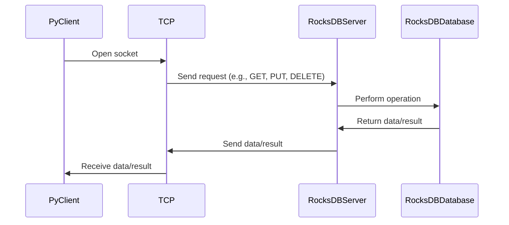

# Python

A Python client for interacting with RocksDB server.

## Overview

This package is a part of the [RocksDBFusion](https://github.com/s00d/RocksDBFusion) project. Before integrating this client into your application, you need to run the RocksDB server provided by RocksDBFusion.

## Installation

You can install the package via pip:

```bash
pip install rocksdb-client
```

## Workflow

Below is the diagram illustrating how the client interacts with the RocksDB server:



## Configuration

### Using the Client

If you want to use the client directly, you can instantiate the `RocksDBClient` class.

1. **Create an instance**:

   ```python
   from rocksdb_client import RocksDBClient

   client = RocksDBClient('127.0.0.1', 12345)

   # If you have a token
   # client = RocksDBClient('127.0.0.1', 12345, 'your-token')
   ```

2. **Usage**:

   ```python
   import asyncio

   async def main():
       # Connect to the server
       await client.connect()

       # Put a value
       await client.put('key', 'value')

       # Get a value
       value = await client.get('key')
       print(value)

       # Delete a key
       await client.delete('key')

   asyncio.run(main())
   ```

## Server Setup

This package is a client for the RocksDB server, which is part of the [RocksDBFusion](https://github.com/s00d/RocksDBFusion) project. Before using this client, ensure the RocksDB server is running. You can set up and run the server by following the instructions in the [RocksDBFusion](https://github.com/s00d/RocksDBFusion) repository.

## Methods

### put

Stores a key-value pair in the database.

```python
await client.put('key', 'value', 'optional_column_family', 'optional_transaction_id')
```

### get

Retrieves the value of a key from the database.

```python
value = await client.get('key', 'optional_column_family', 'default_value', 'optional_transaction_id')
```

### delete

Deletes a key from the database.

```python
await client.delete('key', 'optional_column_family', 'optional_transaction_id')
```

### merge

Merges a value with an existing key.

```python
await client.merge('key', 'value', 'optional_column_family', 'optional_transaction_id')
```

### list_column_families

Lists all column families in the database.

```python
column_families = await client.list_column_families('path_to_db')
```

### create_column_family

Creates a new column family.

```python
await client.create_column_family('new_column_family')
```

### drop_column_family

Drops an existing column family.

```python
await client.drop_column_family('column_family')
```

### compact_range

Compacts the database within a range.

```python
await client.compact_range('start_key', 'end_key', 'optional_column_family')
```

### Transactions

#### Begin Transaction

Begins a new transaction.

```python
txn_id = await client.begin_transaction()
```

#### Commit Transaction

Commits a transaction.

```python
await client.commit_transaction(txn_id)
```

#### Rollback Transaction

Rolls back a transaction.

```python
await client.rollback_transaction(txn_id)
```