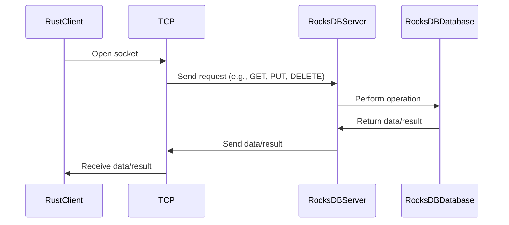

# Rust

A Rust client for interacting with a RocksDB server.

## Overview

This package is a part of the [RocksDBFusion](https://github.com/s00d/RocksDBFusion) project. Before integrating this client into your application, you need to run the RocksDB server provided by RocksDBFusion.

## Installation

You can install the package via Cargo:

```toml
[dependencies]
rocksdb-client-rust = "0.1.0"
```

## Workflow

Below is the diagram illustrating how the client interacts with the RocksDB server:



## Configuration

### Using the Client

If you want to use the client directly, you can instantiate the `RocksDBClient` struct.

1. **Create an instance**:

```rust
use rocksdb_client_rust::RocksDBClient;

let client = RocksDBClient::new("127.0.0.1".to_string(), 12345);

// If you have a token
// let client = RocksDBClient::new_with_token("127.0.0.1".to_string(), 12345, "your-token".to_string());
```

2. **Usage**:

```rust
use tokio::runtime::Runtime;

let rt = Runtime::new().unwrap();
rt.block_on(async {
   // Connect to the server
   let response = client.connect().await;
   if let Err(e) = response {
       eprintln!("Failed to connect: {}", e);
       return;
   }

   // Put a value
   let response = client.put("key".to_string(), "value".to_string(), None, None).await;
   if let Err(e) = response {
       eprintln!("Failed to put value: {}", e);
   }

   // Get a value
   let response = client.get("key".to_string(), None, None, None).await;
   match response {
       Ok(Some(value)) => println!("Value: {}", value),
       Ok(None) => println!("Key not found"),
       Err(e) => eprintln!("Failed to get value: {}", e),
   }

   // Delete a key
   let response = client.delete("key".to_string(), None, None).await;
   if let Err(e) = response {
       eprintln!("Failed to delete key: {}", e);
   }

   // Other available methods...
});
```

## Methods

### put

Stores a key-value pair in the database.

```rust
let response = client.put("key".to_string(), "value".to_string(), None, None).await;
```

### get

Retrieves the value of a key from the database.

```rust
let response = client.get("key".to_string(), None, None, None).await;
```

### delete

Deletes a key from the database.

```rust
let response = client.delete("key".to_string(), None, None).await;
```

### merge

Merges a value with an existing key.

```rust
let response = client.merge("key".to_string(), "value".to_string(), None, None).await;
```

### list_column_families

Lists all column families in the database.

```rust
let response = client.list_column_families("path_to_db".to_string()).await;
```

### create_column_family

Creates a new column family.

```rust
let response = client.create_column_family("new_column_family".to_string()).await;
```

### drop_column_family

Drops an existing column family.

```rust
let response = client.drop_column_family("column_family".to_string()).await;
```

### compact_range

Compacts the database within a range.

```rust
let response = client.compact_range(Some("start_key".to_string()), Some("end_key".to_string()), None).await;
```

### Transactions

#### Begin Transaction

Begins a new transaction.

```rust
let response = client.begin_transaction().await;
```

#### Commit Transaction

Commits a transaction.

```rust
let response = client.commit_transaction(txn_id).await;
```

#### Rollback Transaction

Rolls back a transaction.

```rust
let response = client.rollback_transaction(txn_id).await;
```

## Example

Here is a complete example of using the RocksDB client:

```rust
use rocksdb_client_rust::RocksDBClient;
use tokio::runtime::Runtime;

fn main() {
    let client = RocksDBClient::new("127.0.0.1".to_string(), 12345);

    let rt = Runtime::new().unwrap();
    rt.block_on(async {
        // Connect to the server
        if let Err(e) = client.connect().await {
            eprintln!("Failed to connect: {}", e);
            return;
        }

        // Put a value
        if let Err(e) = client.put("key".to_string(), "value".to_string(), None, None).await {
            eprintln!("Failed to put value: {}", e);
        }

        // Get a value
        match client.get("key".to_string(), None, None, None).await {
            Ok(Some(value)) => println!("Value: {}", value),
            Ok(None) => println!("Key not found"),
            Err(e) => eprintln!("Failed to get value: {}", e),
        }

        // Delete a key
        if let Err(e) = client.delete("key".to_string(), None, None).await {
            eprintln!("Failed to delete key: {}", e);
        }
    });
}