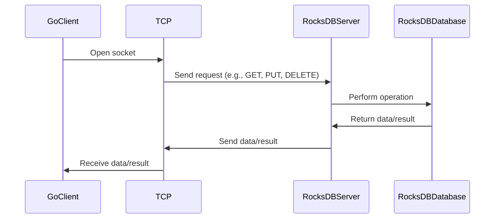

# Go

A Go client for interacting with the RocksDB server.

## Overview

This package is a part of the [RocksDBFusion](https://github.com/s00d/RocksDBFusion) project. Before integrating this client into your application, you need to run the RocksDB server provided by RocksDBFusion.

## Installation

You can install the package by adding the following to your `go.mod` file:

```go
require github.com/s00d/RocksDBFusion/rocksdb-client-go v0.0.0-20240617145652-ad861aa578f3
```

Or by running:

```bash
go get github.com/s00d/RocksDBFusion/rocksdb-client-go
```

## Usage

### Importing the Client

To use the client, you need to import the package and create an instance of the `RocksDBClient`.

1. **Create an instance**:

    ```go
    package main

    import (
        "fmt"
        "log"
        "time"

        rocksdbclient "github.com/s00d/RocksDBFusion/rocksdb-client-go/src"
    )

    func main() {
        // Создание нового клиента
        client := rocksdbclient.NewRocksDBClient("127.0.0.1", 12345, nil, 10*time.Second, 2*time.Second)
        defer client.Close()

        // Подключение к серверу
        if err := client.Connect(); err != nil {
            log.Fatalf("Failed to connect: %v", err)
        }

        // Вставка ключа и значения для тестирования
        key := "test_key"
        value := "test_value"
        if _, err := client.Put(&key, &value, nil, nil); err != nil {
            log.Fatalf("Failed to put value: %v", err)
        }

        // Получение значения по ключу
        response, err := client.Get(&key, nil, nil, nil)
        if err != nil {
            log.Fatalf("Failed to get value: %v", err)
        }

        // Вывод значения
        fmt.Printf("The value for key '%s' is '%s'\n", key, response.Result)
    }
    ```

### Workflow

Below is the diagram illustrating how the client interacts with the RocksDB server:



## Server Setup

This package is a client for the RocksDB server, which is part of the [RocksDBFusion](https://github.com/s00d/RocksDBFusion) project. Before using this client, ensure the RocksDB server is running. You can set up and run the server by following the instructions in the [RocksDBFusion](https://github.com/s00d/RocksDBFusion) repository.

## Methods

### Put

Stores a key-value pair in the database.

```go
response, err := client.Put(&key, &value, nil, nil)
if err != nil {
    log.Fatalf("Failed to put value: %v", err)
}
```

### Get

Retrieves the value of a key from the database.

```go
response, err := client.Get(&key, nil, nil, nil)
if err != nil {
    log.Fatalf("Failed to get value: %v", err)
}
fmt.Printf("The value for key '%s' is '%s'\n", key, response.Result)
```

### Delete

Deletes a key from the database.

```go
response, err := client.Delete(&key, nil, nil)
if err != nil {
    log.Fatalf("Failed to delete value: %v", err)
}
```

### Merge

Merges a value with an existing key.

```go
response, err := client.Merge(&key, &value, nil, nil)
if err != nil {
    log.Fatalf("Failed to merge value: %v", err)
}
```

### ListColumnFamilies

Lists all column families in the database.

```go
response, err := client.ListColumnFamilies()
if err != nil {
    log.Fatalf("Failed to list column families: %v", err)
}
fmt.Println(response.Result)
```

### CreateColumnFamily

Creates a new column family.

```go
response, err := client.CreateColumnFamily(&cfName)
if err != nil {
    log.Fatalf("Failed to create column family: %v", err)
}
```

### DropColumnFamily

Drops an existing column family.

```go
response, err := client.DropColumnFamily(&cfName)
if err != nil {
    log.Fatalf("Failed to drop column family: %v", err)
}
```

### CompactRange

Compacts the database within a range.

```go
response, err := client.CompactRange(&start, &end, nil)
if err != nil {
    log.Fatalf("Failed to compact range: %v", err)
}
```

### Transactions

#### Begin Transaction

Begins a new transaction.

```go
response, err := client.BeginTransaction()
if err != nil {
    log.Fatalf("Failed to begin transaction: %v", err)
}
txnID := response.Result
```

#### Commit Transaction

Commits a transaction.

```go
response, err := client.CommitTransaction(&txnID)
if err != nil {
    log.Fatalf("Failed to commit transaction: %v", err)
}
```

#### Rollback Transaction

Rolls back a transaction.

```go
response, err := client.RollbackTransaction(&txnID)
if err != nil {
    log.Fatalf("Failed to rollback transaction: %v", err)
}
```
