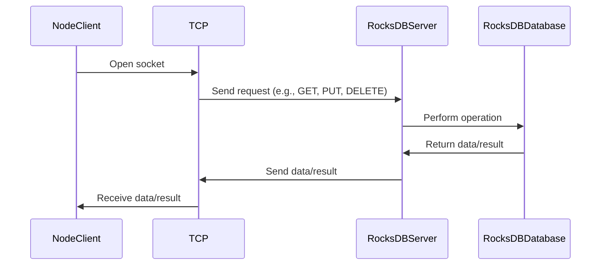

# Node.js

A Node.js client for interacting with RocksDB server.

## Overview

This package is a part of the [RocksDBFusion](https://github.com/s00d/RocksDBFusion) project. Before integrating this client into your application, you need to run the RocksDB server provided by RocksDBFusion.

## Installation

You can install the package via npm:

```bash
npm install rocksdb-client-node
```

## Workflow

Below is the diagram illustrating how the client interacts with the RocksDB server:



## Configuration

### Using the Client

If you want to use the client directly, you can instantiate the `RocksDBClient` class.

1. **Create an instance**:

   ```javascript
   const RocksDBClient = require('rocksdb-client-node');
   
   const client = new RocksDBClient('127.0.0.1', 12345);

   // If you have a token
   // const client = new RocksDBClient('127.0.0.1', 12345, 'your-token');
   ```

2. **Usage**:

   ```javascript
   // Connect to the server
   await client.connect();

   // Put a value
   await client.put('key', 'value');

   // Get a value
   const value = await client.get('key');

   // Delete a key
   await client.delete('key');

   // Other available methods...
   ```

## Server Setup

This package is a client for the RocksDB server, which is part of the [RocksDBFusion](https://github.com/s00d/RocksDBFusion) project. Before using this client, ensure the RocksDB server is running. You can set up and run the server by following the instructions in the [RocksDBFusion](https://github.com/s00d/RocksDBFusion) repository.

## Methods

### put

Stores a key-value pair in the database.

```javascript
await client.put('key', 'value', 'optional_column_family', 'optional_transaction_id');
```

### get

Retrieves the value of a key from the database.

```javascript
const value = await client.get('key', 'optional_column_family', 'default_value', 'optional_transaction_id');
```

### delete

Deletes a key from the database.

```javascript
await client.delete('key', 'optional_column_family', 'optional_transaction_id');
```

### merge

Merges a value with an existing key.

```javascript
await client.merge('key', 'value', 'optional_column_family', 'optional_transaction_id');
```

### listColumnFamilies

Lists all column families in the database.

```javascript
const columnFamilies = await client.listColumnFamilies('path_to_db');
```

### createColumnFamily

Creates a new column family.

```javascript
await client.createColumnFamily('new_column_family');
```

### dropColumnFamily

Drops an existing column family.

```javascript
await client.dropColumnFamily('column_family');
```

### compactRange

Compacts the database within a range.

```javascript
await client.compactRange('start_key', 'end_key', 'optional_column_family');
```

### Transactions

#### Begin Transaction

Begins a new transaction.

```javascript
const txnId = await client.beginTransaction();
```

#### Commit Transaction

Commits a transaction.

```javascript
await client.commitTransaction(txnId);
```

#### Rollback Transaction

Rolls back a transaction.

```javascript
await client.rollbackTransaction(txnId);
```
