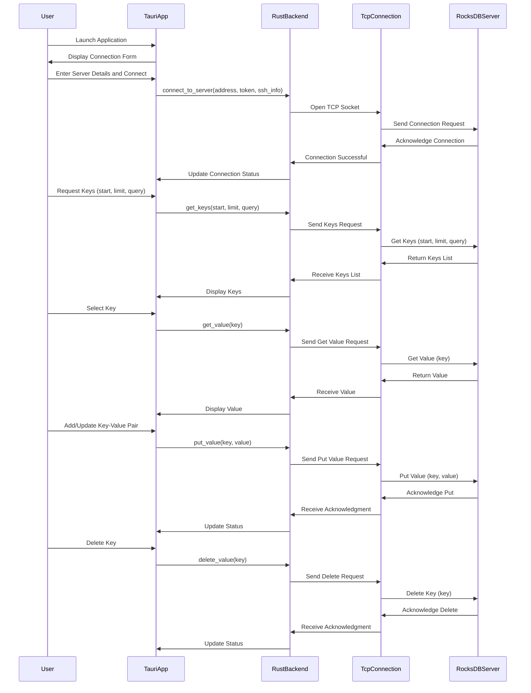

# Viewer

A simple Tauri application to view and interact with a RocksDB database. This application allows you to open a RocksDB database, view the list of keys, and see the values associated with those keys. It also supports pagination and search functionality.

## Features

- Open a RocksDB database
- View the list of keys
- See the values associated with keys
- Pagination for large datasets
- Search functionality

## Screenshots


## Prerequisites

- [Rust](https://www.rust-lang.org/tools/install)
- [Node.js](https://nodejs.org/) (version 14 or higher)
- [Tauri CLI](https://tauri.app/v1/guides/getting-started/prerequisites#installing-tauri-cli)

## Getting Started

### Clone the Repository

```bash
git clone https://github.com/s00d/rocksdb-viewer.git
cd rocksdb-viewer
```

### Install Dependencies

```bash
npm install
```

### Run the Application

```bash
npm run tauri dev
```

### Build the Application

```bash
npm run tauri build
```

### macOS Sign

```bash
xattr -cr ./rocksdb-viewer.app && codesign --force --deep --sign - ./rocksdb-viewer.app
```

### Pre-built Versions

Pre-built versions of the application are available in the [Releases](https://github.com/s00d/RocksDBFusion/releases) section. You can download the appropriate version for your operating system and run the application directly.

## How It Works

The RocksDB Viewer is a Tauri application designed to connect to a RocksDB server and exchange data over a TCP connection. The application uses a Rust backend to handle the communication with the server and a Vue.js frontend to provide a user-friendly interface for viewing and interacting with the data.

### Key Functionalities

- **Connect to Server**: Establishes a connection to the RocksDB server using the provided address and optional authentication token.
- **View Keys**: Displays a list of keys stored in the RocksDB database, with support for pagination to handle large datasets.
- **View Values**: Fetches and displays the value associated with a selected key.
- **Search**: Allows users to search for specific keys in the database.
- **Add/Update Key-Value Pairs**: Users can add new key-value pairs or update existing ones.
- **Delete Keys**: Users can delete keys from the database.

### Detailed Workflow

Below is a detailed workflow of how the client interacts with the RocksDB server:

